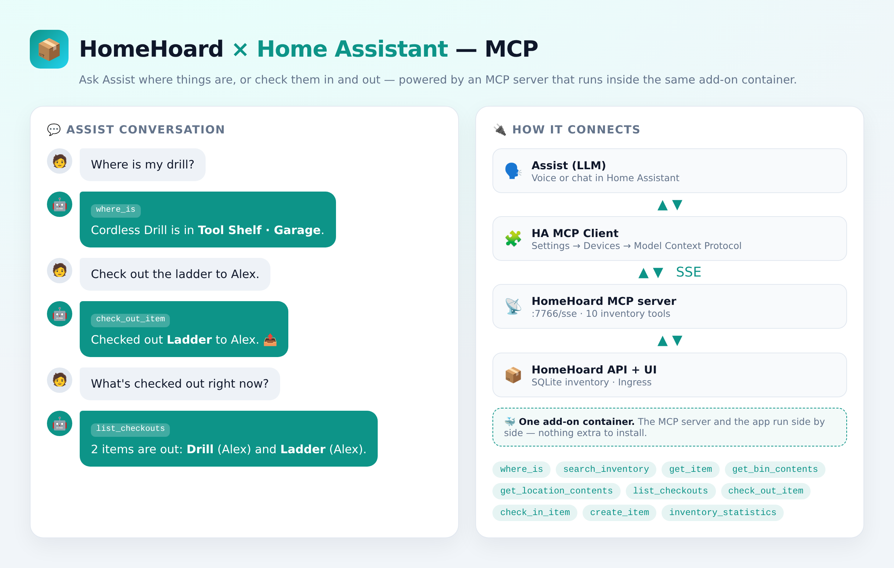
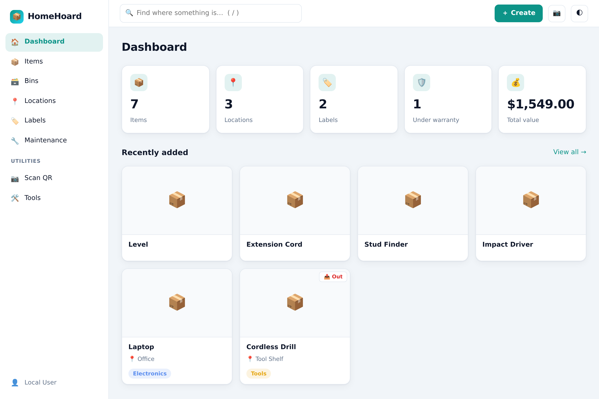
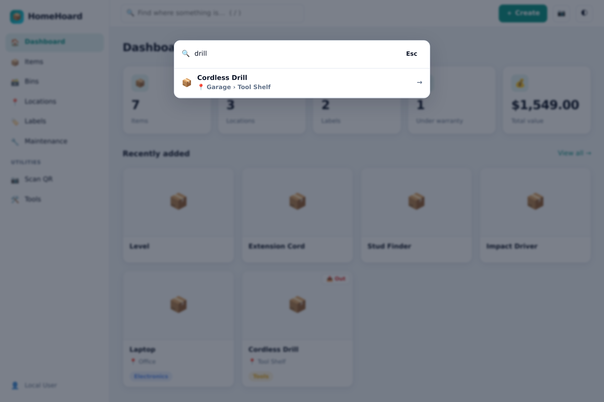
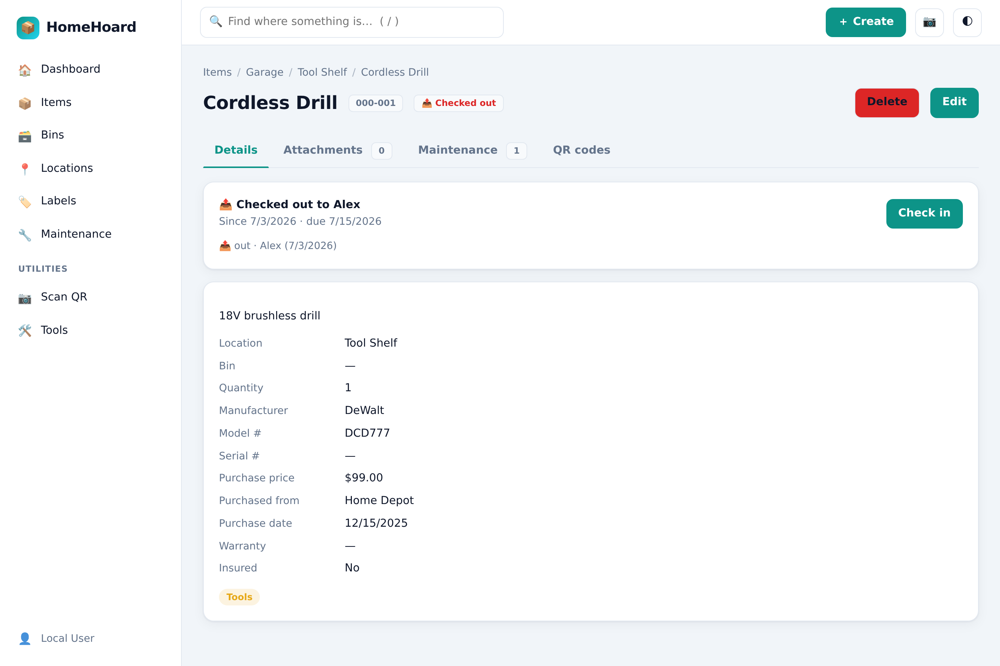
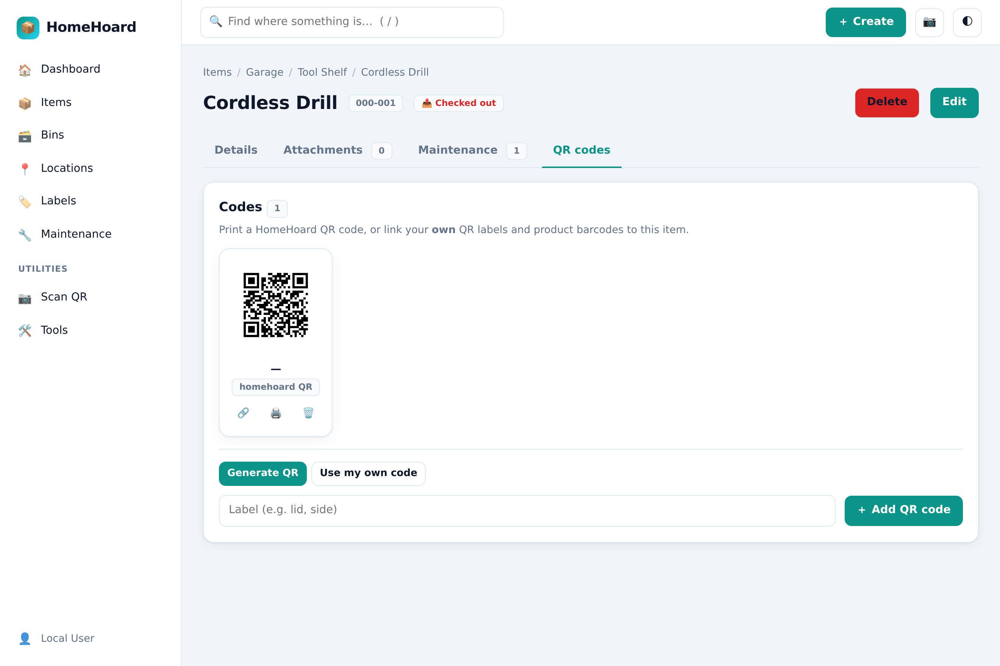
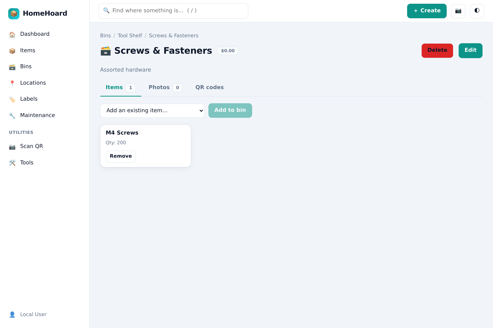
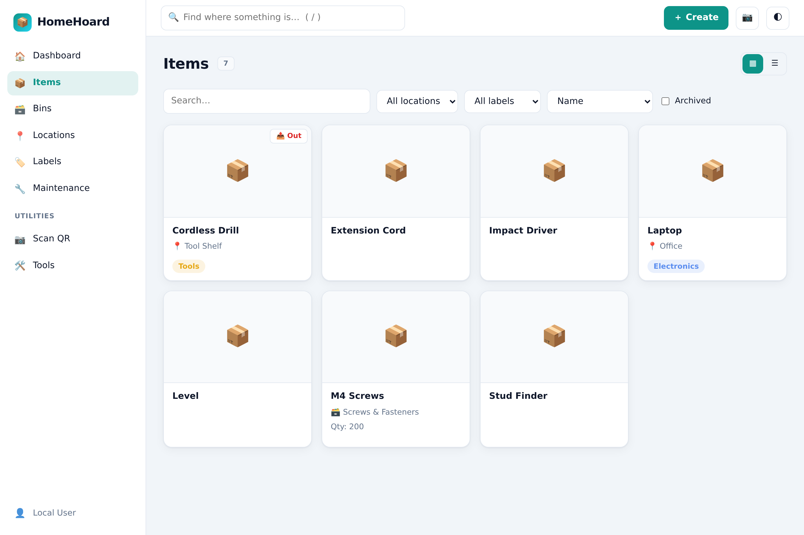

# HomeHoard 📦

**HomeHoard is my own personal rewrite of [homebox](https://github.com/hay-kot/homebox).**

I love what homebox does, but I wanted three things it didn't give me, so I
rebuilt it from the ground up in Python:

1. **Home Assistant, done properly.** HomeHoard runs as a first-class HA **add-on**
   (one-click install, Ingress, no separate login) and ships a companion
   **HACS integration** with inventory **sensors**, a warranties/maintenance
   **calendar**, **voice intents** ("where is my drill?", "check out the drill",
   "what's in the garage?"), `homehoard.locate` / `check_out` / `check_in` /
   `contents` **services** for notifications & automations, and an in-container
   **MCP server** so an LLM-powered Assist can do **everything except adding or
   deleting items** — search, check in/out, and even edit or move things.
2. **QR codes and barcodes that actually fit my life.** Generate printable QR
   labels *and* register your **own** existing QR labels or product barcodes
   (UPC/EAN), stick as many codes as you like on a single bin, and scan any of
   them from your phone to jump straight to the record.
3. **Planning my upcoming move.** I needed **bins** — pack a bin, label it, and
   know exactly what's inside every box and which room it belongs to. Moving a
   bin to a new room moves everything inside it with it.

It's a faithful reimplementation of homebox's data model (aligned with the
maintained [sysadminsmedia/homebox](https://github.com/sysadminsmedia/homebox)
fork) with a **Flask + SQLAlchemy** backend and a **Vue 3 (Vite)** SPA, packaged
to run as a standalone Docker container, a Home Assistant add-on, or on a
Raspberry Pi 5.

> HomeHoard stands on the shoulders of homebox and, like homebox, is licensed
> under **AGPL-3.0**. Huge thanks to [@hay-kot](https://github.com/hay-kot) and
> the homebox community.

## 🏆 The headline: run your inventory from Home Assistant

HomeHoard exposes your whole inventory to Home Assistant — by **voice** (plain
Assist sentences, no LLM needed) and through an **MCP server that runs inside the
same add-on container** for an LLM-powered Assist. Ask *"where is my drill?"*, say
*"check out the drill"* or *"what's in the garage?"*, and — with an LLM agent —
edit or move things too. **Everything except adding or deleting items**, right
from chat or voice.



## 📸 Screenshots

| Dashboard | Find where something is |
|---|---|
|  |  |
| **Item detail — checked out** | **QR codes & barcodes** |
|  |  |
| **Bins** | **Items grid** |
|  |  |

## ✨ What's new

- **⚡ One-click check-out** — one tap checks an item out immediately; add who
  has it, a due date, and notes as an optional next step (in the app and via the
  scanner).
- **🤖 Full MCP surface for Home Assistant** — **12** inventory tools (`where_is`,
  `check_out_item`, `move_item`, `update_item`, `set_checkout_details`, …) over
  SSE, in the same container. **Everything except adding/deleting items** is
  available to an LLM-powered Assist. *(Also fixed the MCP host-header check so
  HA's MCP Client can actually connect to the add-on by hostname.)*
- **🗣️ Voice, no LLM required** — Assist sentences for *"where is my drill?"*,
  *"check out / check in the drill"*, and *"what's in the garage?"* (a bin or
  location's contents), plus matching `homehoard.locate` / `check_out` /
  `check_in` / `contents` services for automations & messaging.
- **📷 Scan-to-checkout** — the camera scanner has **Open / Check out / Check in**
  modes: scan a label to lend or return an item on the spot, or scan a bin /
  location to glance at what's inside — inventory-only, no outbound calls.
- **🗃️ Bins** with photos, plus items that inherit (and follow) their bin's
  location.
- **🩺 HA sensors + calendar** — totals, insured value, checked-out count,
  warranties-expiring, maintenance-overdue, and a warranties/maintenance
  **calendar**.
- **🎨 Polished add-on** — a proper HomeHoard icon & logo, and one-tap
  auto-discovery of the companion integration (no duplicate entries).
- **🚀 Reliable CI** — native amd64 + **arm64 (Raspberry Pi 5)** images, merged
  into a multi-arch manifest and auto-versioned on every push.

## 🗺️ Roadmap

- **Consumables / low-stock** thresholds → a to-do / shopping list entity
- Richer printable QR label sheets
- Multi-language Assist sentences
- Actionable notifications ("Reorder" / "Mark maintenance done")
- Optional **photo recognition** for label-less bins/shelves (AI vision)


## Home Assistant

HomeHoard ships with **both** halves of a proper Home Assistant integration — a
Supervisor **add-on** (the app itself, via Ingress) and a **HACS integration**
(inventory sensors). Set it up in three clicks:

### Step 1 — Add the Supervisor repository

[](https://my.home-assistant.io/redirect/supervisor_add_addon_repository/?repository_url=https%3A%2F%2Fgithub.com%2FAmantux%2Fhomehoard)

Or manually: **Settings → Add-ons → Add-on Store → ⋮ → Repositories** → paste
`https://github.com/Amantux/homehoard`

### Step 2 — Add the integration via HACS

[](https://my.home-assistant.io/redirect/hacs_repository/?owner=Amantux&repository=homehoard&category=integration)

Or manually in HACS: **Integrations → ⋮ → Custom repositories** → paste
`https://github.com/Amantux/homehoard` → category **Integration** → **Add**.

### Step 3 — Start the add-on, watch it appear automatically

Install **HomeHoard** from the add-on store, then **Start** it. Within seconds a
**New device found** card will appear in **Settings → Devices & Services** — no
manual configuration needed.

[](https://my.home-assistant.io/redirect/config_flow_start/?domain=homehoard)

The add-on opens from the sidebar (Ingress, no separate login), stores data in
`/share/homehoard`, and builds for **aarch64** (Raspberry Pi 5) and amd64.

#### What the integration gives you

The companion integration (`custom_components/homehoard`) polls a consolidated
`/api/v1/ha/summary` endpoint and creates one **HomeHoard** device with:

- **Sensors** — total items, total value, insured value, locations, bins,
  labels, **warranties expiring (30d)** (with a 90-day + item list attribute),
  and **maintenance overdue** (with upcoming + entries attribute).
- **Binary sensor** — `Online` (connectivity to the HomeHoard instance).
- **Calendar** — *Warranties & maintenance*: every warranty-expiry and scheduled
  maintenance date as calendar events, so you can automate reminders
  ("notify me 30 days before any warranty expires").
- **Branded icon** — the integration ships its own logo inline
  (`custom_components/homehoard/brand/`, HA 2026.3+ brands proxy), so the
  HomeHoard box shows in Devices & Services with no `home-assistant/brands` PR.

#### Find, check out & query by voice & messaging

The integration wires HomeHoard into Home Assistant so you can **find**, **check
out / in**, and **look inside** your inventory by voice — **no LLM required**
(these are plain Assist intents). *"Where is my drill?"* answers with the
location (e.g. *"Drill is in Tool Bin · Garage › Shelf."*); *"check out the
drill"* lends it; *"what's in the garage?"* reads back the contents.

- **Voice (Assist):** copy
  `custom_components/homehoard/custom_sentences/en/homehoard.yaml` to
  `<your HA config>/custom_sentences/en/homehoard.yaml` and restart HA. Then say:
  - **Find** — *"where is my …"*, *"find the …"*, *"which bin has the …"*
  - **Check out / in** — *"check out the …"*, *"I'm borrowing the …"*,
    *"check in the …"*, *"put back the …"*
  - **Contents** — *"what's in the …"*, *"what's inside the …"*,
    *"contents of the …"* (a bin or location)
- **Services (automations / messaging):** `homehoard.locate` and
  `homehoard.contents` (response services returning `{ speech, … }`), plus
  `homehoard.check_out` / `homehoard.check_in` (by item `name`). Great for
  Telegram/notify bots:

  ```yaml
  # Reply to a Telegram message like "where is my passport"
  - alias: HomeHoard locate over Telegram
    trigger:
      - platform: event
        event_type: telegram_text
    action:
      - service: homehoard.locate
        data:
          query: "{{ trigger.event.data.text }}"
        response_variable: found
      - service: telegram_bot.send_message
        data:
          message: "{{ found.speech }}"
  ```

  `homehoard.locate` returns `{ speech, results[] }`, where each result has
  `type` (item/bin/location), `name`, `where`, and (for bins/locations) `count`.

#### MCP server (for Assist / LLMs)

HomeHoard ships an **MCP server** that runs **in the same container** (no extra
service) and exposes inventory tools to Home Assistant's **MCP Client**
integration — so an **LLM-powered** Assist can call them directly. Everything
**except adding or deleting items** is available:

- **Query** — `where_is`, `search_inventory`, `get_item`, `get_bin_contents`,
  `get_location_contents`, `list_checkouts`, `inventory_statistics`
- **Act** — `check_out_item`, `check_in_item`, `set_checkout_details`,
  `update_item` (edit details), `move_item` (into a bin/location)

> Adding and deleting items are intentionally **not** exposed to Home Assistant —
> do that in the app. HA is for finding, checking out, editing, and moving.

- Served over **SSE on port `7766`** (`/sse`), enabled by default (add-on option
  `enable_mcp`).
- **Connect it in HA:** **Settings → Devices & Services → Add Integration →
  _Model Context Protocol_** — this is the MCP **Client** (it connects HA *to*
  HomeHoard); it is **not** the *MCP Server* integration, which points the other
  way. Point it at
  `http://<addon-hostname>:7766/sse` — e.g. `http://b3264f33-homehoard:7766/sse`
  (the add-on's Supervisor hostname, shown on its info page), or your HA host's
  IP as a fallback.
- The MCP tools are only used when your **conversation agent is an LLM**
  (Settings → Voice assistants → *Conversation agent*). With the default,
  non-LLM agent, use the voice sentences above instead.
- Standalone (outside HA): `python backend/mcp_server.py`
  (`HBOX_MCP_API` points it at the app's API; defaults to `http://127.0.0.1:7745/api/v1`).

Example automation:

```yaml
automation:
  - alias: HomeHoard warranty warning
    trigger:
      - platform: numeric_state
        entity_id: sensor.homehoard_warranties_expiring_30d
        above: 0
    action:
      - service: notify.notify
        data:
          title: HomeHoard
          message: >-
            {{ states('sensor.homehoard_warranties_expiring_30d') }} warranty(s)
            expiring within 30 days.
```


#### The HomeHoard card (Lovelace)

The HACS integration **ships a custom Lovelace card and auto-registers it** — no
manual resource, no helper entities. Add **HomeHoard Card** from the card picker
(or `type: custom:homehoard-card`) for a full overview in a single card:
inventory stats, **quick actions** (find · *what's inside?* · lend & return ·
scan-to-check-out/in · open the app), the **checked-out** list, **recently
added**, and **locations**. Its quick actions call the `homehoard.*` services
directly (with response), so there's nothing else to wire up.

```yaml
type: custom:homehoard-card
# all optional:
title: HomeHoard
app_path: /hassio/ingress/b3264f33_homehoard   # Open / Scan button target
prefix: sensor.homehoard_                        # entity-id prefix
```

The card is driven by the integration's sensors, whose `total_items`,
`locations`, and `checked_out` entities carry `recent` / `locations` / `items`
attributes. Prefer plain **core Lovelace**? `docs/ha/overview_dashboard_core.yaml`
rebuilds the same thing from built-in cards (with `docs/ha/overview_package.yaml`
for the input/script helpers). All examples live under `docs/ha/`.

## Features

- Items with quantity (fractional), purchase/warranty/sold details, custom
  fields (text/number/boolean/**time**), notes — field set aligned with the
  maintained [sysadminsmedia/homebox](https://github.com/sysadminsmedia/homebox) fork
- Nested **locations** (tree) and **labels/tags** (color, icon, hierarchy)
- **Bins**: a location holds bins, and each bin holds a collection of items.
  Items can sit directly in a location or inside a bin.
- **Multiple QR codes per item, bin, or location** — stick several printed
  codes on one physical object; scanning any of them opens that record. QR
  images and print-ready pages included.
- **Check in / out** — mark an item as *here* or *checked out* ("yes it's there,
  no it's not"). **One click checks it out immediately**; who has it, a due date,
  and notes are an optional next step. `/checkouts` lists everything currently out
  (with overdue flags); a *Checked out* HA sensor tracks the count.
- **"Where is it?" search** — a spotlight-style search (top bar or the `/` key)
  matching **items, bins, and locations** and showing the full location path
  (e.g. *Drill → Tool Bin · Garage › Shelf*). Also powers HA voice/MCP.
- **Scan to find & act** — the camera scanner (QR + 1D barcodes) is
  **inventory-only, no outbound calls**, with **Open / Check out / Check in**
  modes: a known code opens the record, checks the item out/in, or shows a
  bin/location's contents inline; an unknown code lets you create or link it on
  the spot.
- **Photos on bins too** — attach photos/files to bins the same way as items.
- File **attachments** & photos (primary photo support)
- **Maintenance** logs per item with cost totals
- **CSV import/export** compatible with homebox's `HB.*` columns
- Auto asset IDs (`000-001`), group statistics & reporting
- Multi-tenant **groups** with invitations
- **Optional auth**: JWT login, or disable it entirely to run behind Home
  Assistant ingress (which already authenticates the user)
- Maintenance actions (ensure asset IDs / import refs, zero time fields, set
  primary photos)

### Web UI

The Vue 3 SPA is a full homebox-style interface:

- **App shell** with sidebar navigation, a global search bar, a **＋ Create**
  quick-add (item/bin/location/label), a **camera QR scanner** button, and a
  **light/dark theme** toggle (persisted).
- **Dashboard** with stat tiles, *recently added* item cards, and a locations
  overview.
- **Items**: card **grid ⇄ table** toggle, search, filter by location/label,
  sort (name / newest / updated / price), archived toggle, pagination.
- **Item detail** with tabs (Details · Attachments · Maintenance · QR),
  breadcrumb location path, hero photo, inline edit, attachment gallery, and a
  maintenance log form.
- **Location & bin detail** pages with tabbed items/bins/sub-locations and QR.
- **Maintenance** page aggregating scheduled/overdue/completed tasks group-wide.
- **Scanner** page/modal using the browser `BarcodeDetector` API to scan a QR or
  barcode with the camera and jump to the item/bin/location — or switch to a
  **Check out / Check in** mode to act on the scanned item, or view a
  bin/location's contents inline (with a manual-entry fallback).
- Toasts, loading skeletons, and empty states throughout.

### Bins & QR codes

- A **bin** belongs to a location and contains items. Adding an item to a bin
  inherits the bin's location. Deleting a bin keeps its items (just detaches
  them). See the **Bins** tab.
- **QR codes** are managed from the QR panel on any item, bin, or location
  detail view. Each code has a short token and encodes a scan URL
  (`<app>/#/t/<token>`). Scanning opens the app, resolves the token, and
  navigates to the record. Scan URLs are **Home Assistant ingress aware** —
  they honor the `X-Ingress-Path` / `X-Forwarded-*` headers so printed codes
  keep working when the app is reached through ingress.

## Project layout

```
homehoard/
├── backend/            # Flask API + SQLAlchemy models
│   ├── app/
│   │   ├── api/        # route blueprints (items, bins, qr, checkout, search, ha, …)
│   │   ├── models/     # SQLAlchemy models
│   │   ├── schemas/    # JSON serializers (homebox-compatible camelCase)
│   │   ├── services/   # CSV import/export
│   │   ├── auth.py     # optional JWT auth layer
│   │   └── __init__.py # app factory (+ SPA serving, additive migrations)
│   ├── mcp_server.py   # MCP server exposed to Home Assistant (SSE)
│   ├── ha_discovery.py # Supervisor discovery registration
│   ├── seed.py         # demo data
│   ├── run.py          # dev entrypoint
│   └── tests/          # pytest suite
├── frontend/           # Vue 3 + Vite SPA
├── custom_components/  # HACS integration (custom_components/homehoard)
├── homehoard/          # HA add-on (config.yaml, DOCS.md, CHANGELOG.md)
├── repository.yaml     # HA add-on repository manifest (root, for Supervisor)
├── hacs.json           # HACS repository manifest
├── docker-entrypoint.sh# starts the app + MCP server in one container
├── Dockerfile          # standalone / add-on multi-arch image
└── docker-compose.yml
```

## Quick start (development)

Clone the repository:

```bash
git clone https://github.com/Amantux/homehoard.git
cd homehoard
```

Backend:

```bash
cd backend
pip install -r requirements.txt
python seed.py          # optional demo data
python run.py           # serves http://localhost:7745
```

Frontend (hot-reload dev server, proxies /api to :7745):

```bash
cd frontend
npm install
npm run dev             # http://localhost:5173
```

## Production / Docker

```bash
docker compose up --build
# → http://localhost:7745  (frontend + API from one container)
```

The image builds the Vue app and serves it from Flask, so a single container
runs the whole stack.


## Configuration (environment variables)

| Variable | Default | Description |
|---|---|---|
| `HBOX_DATA_DIR` | `./data` | SQLite DB + attachments location |
| `HBOX_DATABASE_URL` | _(sqlite in DATA_DIR)_ | Override the SQLAlchemy URL |
| `HBOX_SECRET_KEY` | `change-me-in-production` | JWT signing key (use ≥ 32 chars) |
| `HBOX_DISABLE_AUTH` | `false` | Skip auth; bind all requests to a default local user/group |
| `HBOX_ALLOW_REGISTRATION` | `true` | Allow public self-registration |
| `HBOX_JWT_HOURS` | `168` | Token lifetime |
| `HBOX_MAX_UPLOAD_MB` | `50` | Max attachment upload size |
| `HBOX_PORT` | `7745` | App (API + UI) port |
| `HBOX_FRONTEND_DIST` | `../frontend/dist` | Built SPA directory |
| `HBOX_MCP_ENABLED` | `true` | Run the MCP server (in-container) |
| `HBOX_MCP_PORT` | `7766` | MCP SSE port |
| `HBOX_MCP_API` | `http://127.0.0.1:7745/api/v1` | API base the MCP server calls |
| `HBOX_MCP_API_TOKEN` | _(none)_ | Bearer token for the MCP server's API calls (only if app auth is on) |

Home Assistant add-on options: `disable_auth`, `allow_registration`, `enable_mcp`.

## API

JSON REST API under `/api/v1`, mirroring homebox's routes — e.g.
`/items`, `/items/{id}` (GET/PUT/PATCH/DELETE), `/items/import`,
`/items/export`, `/locations`, `/locations/tree`, `/labels`, `/groups/statistics`,
`/users/login`, `/users/self`, `/notifiers`, `/actions/*`, `/qrcode`, `/status`.

Bin & QR extensions:

| Method | Path | Description |
|---|---|---|
| GET/POST | `/bins` | List / create bins (`?location=<id>` filter) |
| GET/PUT/DELETE | `/bins/{id}` | Bin detail / update / delete (items kept) |
| PUT/DELETE | `/bins/{id}/items/{itemId}` | Add / remove an item to/from a bin |
| GET/POST | `/qr-tags` | List (`?kind=&targetId=`) / create a QR tag |
| GET/DELETE | `/qr-tags/{id}` | Get / delete a QR tag |
| GET | `/qr-tags/{id}/image` | PNG of the QR code |
| GET | `/qr-tags/resolve/{token}` | Resolve a scanned token to its target |

`POST /qr-tags` body: `{ "kind": "item"｜"bin"｜"location", "targetId": "<id>", "description": "optional" }`.

Search, scan, check in/out & Home Assistant:

| Method | Path | Description |
|---|---|---|
| GET | `/search?q=` | Find items, bins, and locations with a location path (`?types=item,bin,location`) |
| GET | `/barcode/{code}` | Inventory-only lookup — registered code → record (+ bin/location contents), else `not_found` |
| POST | `/items/{id}/checkout` | Check an item out (`{ person?, due?, notes? }`) |
| PATCH | `/items/{id}/checkout` | Update an active checkout's details (`{ person?, due?, notes? }`) |
| POST | `/items/{id}/checkin` | Check an item back in |
| GET | `/items/{id}/checkout` | Current status + check in/out history |
| GET | `/checkouts` | Everything currently checked out (with `overdue` flags) |
| GET | `/bins/{id}/attachments` … | Bin photos/attachments (mirrors item attachments) |
| GET | `/ha/summary` | Totals + attention counts (warranties expiring, maintenance overdue, checked out) |
| GET | `/ha/calendar?start=&end=` | Warranty-expiry + scheduled-maintenance events |

An **MCP server** (SSE on `:7766`) exposes these as tools for Home Assistant —
see [MCP server](#mcp-server-for-assist--llms) above.

## Tests & CI

```bash
cd backend
pip install -r requirements.txt pytest
pytest
```

GitHub Actions (`.github/workflows/ci.yml`) on every push to `main`: runs the
backend test suite + frontend build, **auto-bumps the patch version** (keeping
`homehoard/config.yaml` and the integration manifest in lockstep), then builds
the image **natively per arch** — amd64 on `ubuntu-latest`, **arm64 (Raspberry
Pi 5) on `ubuntu-24.04-arm`** — and merges them into a single multi-arch
manifest published to GHCR (`ghcr.io/amantux/homehoard:<version>` and `:latest`).

### Running on a Raspberry Pi 5

```bash
docker run -d --name homehoard -p 7745:7745 \
  -e HBOX_DISABLE_AUTH=false \
  -e HBOX_SECRET_KEY="$(openssl rand -hex 32)" \
  -v homehoard-data:/data \
  ghcr.io/amantux/homehoard:latest
```

## License

HomeHoard is a personal rewrite of homebox and, like homebox, is distributed
under the **GNU Affero General Public License v3.0** (see [`LICENSE`](LICENSE)).
